# [上下文管理](https://www.volcengine.com/docs/82379/2123288?lang=zh)
模型上下文（Context）包括输入信息（问题）和输出信息（回答），当触发深度思考时输出还包括思维链内容（COT）。思维链内容展现模型处理问题的过程，包括将问题拆分为多个问题进行处理，生成多种回复综合得出更好回答的过程。在多轮对话中，上下文管理在保持话题一致性等方面非常重要，对此方舟提供了一些管理上下文的方法。

# 上下文输入

## 手动输入上下文
[Chat API](https://www.volcengine.com/docs/82379/1494384) 发起请求，是独立无状态的，需手动管理上下文。需通过交替排列 user 消息 与 assistant 消息，让模型在请求中获取之前对话信息。

```Python
import os
# Install SDK:  pip install 'volcengine-python-sdk[ark]'
from volcenginesdkarkruntime import Ark 

client = Ark(
    # The base URL for model invocation
    base_url="https://ark.cn-beijing.volces.com/api/v3",
    # Get API Key：https://console.volcengine.com/ark/region:ark+cn-beijing/apikey
    api_key=os.getenv('ARK_API_KEY'), 
    # Deep thinking takes longer; set a larger timeout, with 1,800 seconds or more recommended
    timeout=1800,
)

# 创建一个对话请求
completion = client.chat.completions.create(
    # Replace with Model ID
    model = "doubao-seed-1-6-251015",
    messages=[
        {"role": "user", "content": "研究深度思考模型与非深度思考模型区别"},
        {"role": "assistant", "content": "推理模型主要依靠逻辑、规则或概率等进行分析、推导和判断以得出结论或决策，非推理模型则是通过模式识别、统计分析或模拟等方式来实现数据描述、分类、聚类或生成等任务而不依赖显式逻辑推理。"},
        {"role": "user", "content": "我要研究深度思考模型与非深度思考模型区别的课题，怎么体现我的专业性"},
    ],
)

if hasattr(completion.choices[0].message, 'reasoning_content'):
    print(completion.choices[0].message.reasoning_content)
print(completion.choices[0].message.content)
```

* 您可按需替换 Model ID。Model ID 查询见 [模型列表](https://www.volcengine.com/docs/82379/1330310)。


## 通过 ID 输入上下文
[Responses API](https://www.volcengine.com/docs/82379/1569618) 支持更简洁方式管理上下文。默认情况下请求的输入和输出都会持久化存储，后续请求只需传入 ID 就可以引入对应请求的输入和输出。

```Python
import os
from volcenginesdkarkruntime import Ark

# Get API Key：https://console.volcengine.com/ark/region:ark+cn-beijing/apikey
api_key = os.getenv('ARK_API_KEY')

client = Ark(
    base_url='https://ark.cn-beijing.volces.com/api/v3',
    api_key=api_key,
)

# Create the first-round conversation request
response = client.responses.create(
    model="doubao-seed-1-6-251015",
    input="Hi，帮我讲个笑话。"
)
print(response)

# Create the second-round conversation request
second_response = client.responses.create(
    model="doubao-seed-1-6-251015",
    previous_response_id=response.id,
    input=[{"role": "user", "content": "这个笑话的笑点在哪？"}],
)
print(second_response)
```


# 上下文长度控制
输入长内容，或对话轮数增加，需同时考虑模型输出长度和上下文窗口限制。模型输入和输出会进行计量，达到长度限制会截断或报错。合理控制模型输出长度，平衡业务效果、成本与稳定性：

* 减少触发限流（TPM 限制、突发流量限制等），保障服务稳定性。
* 精确控制 token 用量，平衡成本与质量。
* 控制推理耗时，提升用户交互体验。

同时，平台支持对模型输出（思维链、回答）长度控制，来控制 token 用量。核心规格及参数，如下图：

 
> 不同模型支持的上下文窗口、最大输入、最大思维链长度均有差异，可在 [模型列表](https://www.volcengine.com/docs/82379/1330310) 查询。


## 控制输出（回答+思维链）长度
[Chat API](https://www.volcengine.com/docs/82379/1494384) 使用 **max_completion_tokens** 字段，控制模型输出长度，当模型输出达到配置值时，模型停止推理。
> [Responses API](https://www.volcengine.com/docs/82379/1569618) 使用 max_output_tokens 字段 控制模型输出长度，详细信息参见 [设置最大输出长度](../9.使用 Responses API/3.深度思考.md#设置最大输出长度)。

支持的模型：250528及之后版本的大语言模型，如无特殊说明，默认支持该字段。方舟平台大语言模型列表，请参见[文本生成能力](https://www.volcengine.com/docs/82379/1330310#b318deb2)。
> doubao-1-5-pro-32k-character-250715 模型不支持该字段。


```Python
import os
# Install SDK:  pip install 'volcengine-python-sdk[ark]'
from volcenginesdkarkruntime import Ark 

client = Ark(
    # The base URL for model invocation
    base_url="https://ark.cn-beijing.volces.com/api/v3",
    # Get API Key：https://console.volcengine.com/ark/region:ark+cn-beijing/apikey
    api_key=os.getenv('ARK_API_KEY'), 
    # Deep thinking takes longer; set a larger timeout, with 1,800 seconds or more recommended
    timeout=1800,
)

# 创建一个对话请求
completion = client.chat.completions.create(
    # Replace with Model ID
    model = "doubao-seed-1-6-251015",
    messages=[
        {"role": "system", "content": "你是 AI 人工智能助手"},
        {"role": "user", "content": "常见的十字花科植物有哪些？"},
    ],
    # 设置模型最大输出长度为 1024 token，按需调整
    max_completion_tokens = 1024,
)
print(completion.choices[0].message.content)
```

* 您可按需替换 Model ID。Model ID 查询见 [模型列表](https://www.volcengine.com/docs/82379/1330310)。


> 💡
>
> * **max_tokens**、**max_completion_tokens** 不可同时设置，会直接报错。
>
&nbsp;

## 控制回答长度
[Chat API](https://www.volcengine.com/docs/82379/1494384) 可通过设置 **max_tokens** 字段，控制模型回答长度。当回答长度达到配置值时，模型停止推理。

```Python
import os
# Install SDK:  pip install 'volcengine-python-sdk[ark]'
from volcenginesdkarkruntime import Ark 

# 初始化Ark客户端
client = Ark(
    # The base URL for model invocation
    base_url="https://ark.cn-beijing.volces.com/api/v3", 
    # Get API Key：https://console.volcengine.com/ark/region:ark+cn-beijing/apikey
    api_key=os.getenv('ARK_API_KEY'), 
)

completion = client.chat.completions.create(
    # Replace with Model ID
    model = "doubao-seed-1-6-251015",
    messages=[
        {"role": "system", "content": "你是 AI 人工智能助手"},
        {"role": "user", "content": "常见的十字花科植物有哪些？"},
    ],
    # 设置模型最大输出长度为 1024 token，您可按需进行调整
    max_tokens=1024,
)
print(completion.choices[0].message.content)
```

* 按需替换 Model ID，查询 Model ID 请参见 [模型列表](https://www.volcengine.com/docs/82379/1330310)。


> 💡
>
> * **max_tokens**、**max_completion_tokens** 不可同时设置，会直接报错。
> * [Responses API](https://www.volcengine.com/docs/82379/1569618) 不支持 **max_tokens** 字段。
>

## 控制思维链长度 [ 新增 ]
设置 **reasoning_effort** 调节深度思考的程度，间接控制思维链内容长度。当前提供4档：

* `minimal`：关闭思考，直接回答。
* `low`：轻量思考，侧重快速响应。
* `medium`：均衡模式，兼顾速度与深度。
* `high`：深度分析，处理复杂问题。

与 **thinking.type** 关系：

* **thinking.type**取值为`enabled`：支持配置**reasoning_effort**。当**reasoning_effort**取值为`minimal`时，则关闭思考，直接回答。
* **thinking.type**取值为`disabled`：**reasoning_effort**仅支持取值`minimal`。当**reasoning_effort**取值为`low`、`medium`、`high`时会报错。


```Python
import os
# Install SDK:  pip install 'volcengine-python-sdk[ark]'
from volcenginesdkarkruntime import Ark 

client = Ark(
    # The base URL for model invocation
    base_url="https://ark.cn-beijing.volces.com/api/v3",
    # Get API Key：https://console.volcengine.com/ark/region:ark+cn-beijing/apikey
    api_key=os.getenv('ARK_API_KEY'), 
    # Deep thinking takes longer; set a larger timeout, with 1,800 seconds or more recommended
    timeout=1800,
)

completion = client.chat.completions.create(
    # Replace with Model ID  .
    model = "doubao-seed-1-6-251015",
    messages=[
        {
            "role": "user",
             "content": [                
                {"type": "image_url","image_url": {"url":  "https://ark-project.tos-cn-beijing.ivolces.com/images/view.jpeg"}},
                {"type": "text", "text": "图片主要讲了什么?"},
            ],
        }
    ],
    thinking={"type":"enabled"},
    reasoning_effort="low"
)

print(completion.choices[0])
```


完整代码及使用，请参见 [调节思考长度](../9.使用 Responses API/3.深度思考.md#调节思考长度)（Responses API）、[调节思考长度](1.深度思考.md#调节思考长度)（ChatCompletion API）。

# 上下文传递逻辑

## 多轮对话场景


### 流程图



### 说明

* 在每一轮对话过程中，深度思考模型会输出思维链内容（COT）和最终回答（Answer）。
* 在下一轮对话中，之前输出的思维链内容不会被拼接到上下文中。
> 思维链内容展现的是模型处理问题的过程，包括将问题拆分为多个问题进行处理，生成多种回复综合得出更好回答等过程。

### 多轮对话场景


## 工具调用场景
工具调用场景中开启深度思考后，思维链处理策略变更如下：

* 旧策略（doubao-seed-1.8 之前的模型）：开启深度思考后，会直接丢弃生成的思维链内容，思维链内容不参与后续轮次的推理。
* 新策略（doubao-seed-1.8 及部分迭代模型）：针对工具调用场景优化了深度思考的执行逻辑，平台会自主判断是否将思维链内容输入给模型，参与后续轮次的推理，保障结果输出连贯、准确、可解释。

策略变更会导致模型输入 tokens 增加，其中未输入给模型的思维链内容，不会计算 tokens 用量。


### 流程图



### 说明

* 回答问题 1 时（请求 1.1 - 1.2），模型进行多次思考 + 工具调用后给出答案，方舟会输入完整上下文包括思维链内容给模型处理。
* 开始回答问题2时（请求 2.1），方舟会自行判断并删除之前上下文中的思维链，输入给模型。

### 工具调用场景


> 💡
> 推荐在 Responses API 中使用 previous_response_id，平台自动保存历史对话的上下文，并在多轮交互中回传给推理服务。
请求示例如下：

> ✍️ 已移除 Chat API 选项卡，省略 131 行。

**Responses API**

**第一轮请求：触发工具调用**
```Bash
curl https://ark.cn-beijing.volces.com/api/v3/responses \
    -H "Authorization: Bearer $ARK_API_KEY" \
    -H "Content-Type: application/json" \
    -d '{
        "model": "doubao-seed-1-8-251228",      
        "input": [
            {
                "role": "system",
                "content": "你是人工智能助手."
            },
            {
                "role": "user",
                "content": "今天北京天气怎么样"
            }
        ],
        "thinking":{"type": "enabled"},
        "tools": [
            {
                "type": "function",
                "name": "get_weather",
                "description": "天气查询",
                "parameters": {
                    "type": "object",
                    "properties": {
                        "location": {
                            "type": "string",
                            "description": "地点的位置信息，例如北京、上海。",
                        }
                    },
                    "required": ["location"]
                }
            }
        ]
    }'
```

**第一轮响应：返回工具调用指令**
模型返回信息包含`id`、`call_id`、`arguments`等关键字段。
```Bash
{
    "created_at": 1766126702,
    "id": "resp_0217661267019147d8950efa0e2f7c9d9cc7a1cc971272cf4548c",
    "max_output_tokens": 32768,
    "model": "doubao-seed-1-8-251228",
    "object": "response",
    "output": [
        {
            "id": "rs_02176612670248500000000000000000000ffffac154e10754f5c",
            "type": "reasoning",
            "summary": [
                {
                    "type": "summary_text",
                    "text": "用户问今天北京的天气怎么样，我需要调用get_weather工具，参数location是北京。按照格式要求来写函数调用。"
                }
            ],
            "status": "completed"
        },
        {
            "arguments": " {\"location\": \"北京\"}",
            "call_id": "call_t885uulopdd499rn0pioze7l",
            "name": "get_weather",
            "type": "function_call",
            "id": "fc_02176612670345400000000000000000000ffffac154e10a6753e",
            "status": "completed"
        }
    ],
    ....
 }
```

**第二轮请求：回传结果并生成最终响应**
传入上一轮 response_id、工具调用结果等信息，模型生成自然语言回答。
```Bash
curl https://ark.cn-beijing.volces.com/api/v3/responses \
    -H "Authorization: Bearer $ARK_API_KEY" \
    -H "Content-Type: application/json" \
    -d '{
        "model": "doubao-seed-1-8-251228",
        "input": [
            {
                "type": "function_call_output",
                "call_id": "call_t885uulopdd499rn0pioze7l",
                "output": "5度"
            }
        ],
        "previous_response_id": "resp_0217661267019147d8950efa0e2f7c9d9cc7a1cc971272cf4548c",
        "thinking":{"type": "enabled"},
        "tools": [
            {
                "type": "function",
                "name": "get_weather",
                "description": "天气查询",
                "parameters": {
                    "type": "object",
                    "properties": {
                        "location": {
                            "type": "string",
                            "description": "地点的位置信息，例如北京、上海。"
                        }
                    },
                    "required": ["location"]
                }
            }
        ]
    }'
```


# 长度限制生效逻辑
模型输出的组成如下公式，模型的输出 = 模型的回答 + 模型的思维链（如有）

* **max_tokens**：控制模型的回答长度，如触发长度限制，模型停止回答，并在返回结构体的 **finish_reason** 字段为 `length`。
* **max_completion_tokens**：控制模型的回答、模型思维链总长度，如触发限制，模型停止回答，并在返回结构体的 **finish_reason** 字段为 `length`。如配置了 **max_completion_tokens** ，max_tokens默认值会失效，常用于超长文本输出或者控制模型返回长度。


## 仅配置 max_tokens（默认逻辑）
下面是各个对象的长度限制说明。

|对象 |关键参数 |说明 |可否配置 |
|---|---|---|---|
|问题 |最大输入长度 |`上下文窗口 - 思维链窗口`，与回答共享配额。|模型规格，不可配置 |
| | |> 可理解为问答配额。 | |
|思维链 |思维链窗口 |独占，不共享，即单次请求如有未使用的配额也不共享给问题及回答。 |模型规格，不可配置 |
|回答 |最大回答长度 |最大回答长度，通过 **max_tokens** 参数配置。|API字段，可配置 |
| | |另外随着输入长度增加，回答配额也会受 **最大输入长度（问答配额）**  剩余配额影响。| |
| | |回答配额| |
| | |=`min(最大回答长度, 最大输入长度-实际输入长度)`| |
| | |=`min(最大回答长度, 上下文窗口-思维链窗口-实际输入长度)` | |
|^^|最大输入长度 |^^|模型规格，不可配置 |

内容截断逻辑举例：模型A属性如下，上下文窗口 96k，思维链窗口 32k，最大输入长度(问答配额) 64k，配置最大回答长度 16k。

* 当用户输入的问题 56k，模型输出思维链16k，模型输出的回答达到8k时，`问题+回答 = 56k+8k = 64k`，触发**最大输入长度（问答配额）** 限制，模型停止推理。
* 当用户输入的问题 22k，模型输出思维链16k，模型输出的回答达到16k时，触发**最大回答长度**限制，模型停止推理。
* 当用户输入的问题 22k，模型输出思维链32k，触发**最大思维链长度**限制，模型停止推理。


## 仅配置 **max_completion_tokens**

|影响/控制对象 |关键参数 |说明 |可否配置 |
|---|---|---|---|
|问题 |最大输入长度 |与回答共享配额，即未使用配额共享给回答内容 |模型规格，不可配置 |
|思维链 |最大输出长度 |与回答共享配额，即未使用的配额共享给回答。 |API字段，可配置 |
|^^|思维链窗口 |模型能够输出的最大思维链长度。 |模型规格，不可配置 |
|回答 |最大输出长度 |与思维链共享配额，即输出长度不可超过`最大输出长度-已输出的思维链内容长度` |API字段，可配置 |

内容截断逻辑举例：模型A属性如下，上下文窗口 96k，最大输入长度 64k，最大思维链长度 32k。配置最大输出长度（**max_completion_tokens**） 32k 后，最大回答长度（**max_tokens**）默认值(`4096`)限制失效：

* 当用户输入的内容长度 72k，触发**最大输入长度**限制，直接报错。
* 当模型输出的内容超过 32k，触发 **最大思维链长度** 限制，模型停止推理。
* 当用户输入的问题长度 26k，模型输出的思维链长度 16k，模型输出的回答长度达到 16k 时，`思维链长度+回答长度=16k+16k=32k`，触发**最大输出长度** 限制，模型停止推理。

&nbsp;


