# [原理及选型](https://www.volcengine.com/docs/82379/1398933?lang=zh)
在多轮对话、工具调用及角色扮演等存在大量重复上下文输入的场景中，利用上下文缓存机制复用计算结果，避免模型对相同内容的重复处理。这将有效消除重复加载带来的开销，显著降低 Token 成本。
> 💡
> 方舟平台的新用户？获取 API Key 及 开通模型等准备工作，请参见 [快速入门](https://www.volcengine.com/docs/82379/1399008)。

# 效果示例
下面是使用 Responses API 实现缓存的示例，通过缓存需要处理的《麦琪的礼物》长文本，可以在后续的文本处理请求中，减少成本 80% 。

```Python
# encoding=utf-8
import os
from volcenginesdkarkruntime import Ark

client = Ark(
    base_url='https://ark.cn-beijing.volces.com/api/v3',
    api_key=os.getenv('ARK_API_KEY'),
)
# Input must exceed 256 tokens; otherwise, prefix cache cannot be created.
input_text = "You are a literary analysis assistant. Answer concisely and clearly. Here is an excerpt from The Gift of the Magi by O. Henry. <long excerpt>"
response = client.responses.create(
    model="doubao-seed-1-6-251015",
    input=[
        {
            "role": "system",
            "content": input_text,
        }
    ],
    caching={"type": "enabled", "prefix": True}, 
    thinking={"type": "disabled"},
)
print(response.usage.model_dump_json())

second_response = client.responses.create(
    model="doubao-seed-1-6-251015",
    previous_response_id=response.id,
    input=[{"role": "user", "content": "Briefly summarize the story in 5 bullet points."}],
    caching={"type": "enabled"}, 
    thinking={"type": "disabled"},
)

print(second_response.output[0].content[0].text)
print(second_response.usage.model_dump_json())
```


返回的`usage`信息如下：
```JSON
{"input_tokens":2535,"input_tokens_details":{"cached_tokens":0},"output_tokens":0,"output_tokens_details":{"reasoning_tokens":0},"total_tokens":2535,"tool_usage":null,"tool_usage_details":null}
{"input_tokens":2551,"input_tokens_details":{"cached_tokens":2535},"output_tokens":133,"output_tokens_details":{"reasoning_tokens":0},"total_tokens":2684,"tool_usage":null,"tool_usage_details":null}
```

> 在上面示例的长文本场景中，第2次请求 `"cached_tokens":2535` ，以`doubao-seed-1-6-251015`模型为例，相比未使用缓存，带缓存的请求费用下降 80%。在超长输入，如超长文本或超长历史对话场景下，成本下降将更加明显。


# 工作原理
与未使用缓存的请求相比，此方式减少了上下文信息转 tokens 的重复计算及读写开销，从而有效降低成本。


|原理图 |说明 |
|---|---|
| |1. 将上下文信息计算为 tokens 并存入缓存。|
| |2. 新一轮调用时，将新输入的问题计算为 tokens。|
| |3. 将新输入的问题 tokens 直接拼接在上下文 tokens 之后，输入模型进行推理。 |


# 选型流程
要为您的业务选择合适的缓存方案，请遵循以下两个步骤：

1. **选择模型并确定 API**

由于每个模型最多只支持一种用于调用缓存的 API，因此一旦您选定模型，可用的 API 也就随之确定。

根据您的业务需求选择合适的模型，支持缓存的模型：[上下文缓存能力](https://www.volcengine.com/docs/82379/1330310#476e6f25)。

2. **选择缓存类型**

根据您的使用场景选择缓存类型。平台支持以下两种：

* **Session 缓存**：缓存内容会随每轮对话动态更新，适合多轮对话和工具调用等场景。
* **前缀缓存**：缓存内容保持固定，适合需要反复使用长文本输入或固定系统提示词的场景。

详细类型说明见下文。

# 缓存类型
上下文缓存有两种类型，分别为 Session 缓存和前缀缓存。

## Session 缓存
**存储初始信息**，同时**随每一轮对话动态更新缓存**。在新一轮请求，将缓存信息与输入信息一起输入给模型进行推理。适合在多轮对话、多轮工具调用等场景使用。


|原理图 |说明 |
|---|---|
| |1. 用户创建缓存时，方舟将信息处理为 可直接用于模型推理的tokens 存入缓存，并生成 ID 作为 Key。|
| |2. 方舟收到新请求，计算好新输入的tokens，并根据请求中的缓存 ID 取对应信息 tokens 拼接后输入给模型推理。|
| |3. 模型返回信息，方舟**将回复信息的tokens 存储入缓存**中，供下次请求时使用。 |


## 前缀缓存
存储初始信息，在每次对话时无需更新，适合标准化对话开场白、特定任务的指令、规则化模板、超长文本深度分析等静态 Prompt 模板的反复使用场景。


|原理图 |说明 |
|---|---|
| |1. 用户创建缓存时，方舟将信息处理为 可直接用于模型推理的tokens 存入缓存，并生成 ID 作为 Key。|
| |2. 方舟收到新请求，计算好新输入的tokens，并根据请求中的缓存 ID 取对应信息 tokens 拼接后输入给模型推理。|
| |3. 模型输出回复信息，无需更新缓存中的信息。 |


# 调用方式及对比
平台提供了两种 API 来实现上下文缓存功能。由于每个模型最多只支持一种缓存 API，因此当您选定模型后，能够使用的 API 也就随之确定。

下表简要对比了这两种 API 的调用方式与核心区别。您可以查阅相应的 API 教程，获取详细的调用说明和代码示例。


|API |[Responses API](https://www.volcengine.com/docs/82379/1569618) |[Context Create API](https://www.volcengine.com/docs/82379/1528789) |
|---|---|---|
|教程 |[上下文缓存](../../9.使用 Responses API/6.上下文缓存.md) |[上下文缓存(Context API)](2.上下文缓存(Context API).md) |
|模型支持 |[上下文缓存能力](https://www.volcengine.com/docs/82379/1330310#476e6f25) |[上下文缓存能力](https://www.volcengine.com/docs/82379/1330310#476e6f25) |
|使用流程 |1. 缓存信息：在对话时配置`"caching": {"type": "enabled" }`创建Session缓存，配置`"caching":{"type": "enabled", "prefix": True}`创建前缀缓存，存储当前对话内容到缓存中。在返回信息中获取 ID 值。|1. 缓存信息：使用 [Context Create API](https://www.volcengine.com/docs/82379/1528789) 创建缓存信息，并指定创建的缓存类型（Session 缓存、前缀缓存）。在返回信息中获取缓存 ID 值。|
| |2. 使用缓存：在对话时配置 `"previous_response_id":"<ID>"`，本轮对话使用缓存信息。|2. 使用缓存：通过 [Context Chat API](https://www.volcengine.com/docs/82379/1529329) 配置 `"context_id":"<ID>"`，本轮对话使用缓存信息。|
| |   * Session 缓存：每次使用缓存同时配置`"caching": {"type": "enabled" }`，**将本轮信息也更新到缓存中，并生成新 ID。下一轮调用获取本轮调用返回的 ID。** |   * Session 缓存：每次使用缓存时，**更新本轮信息至缓存中**。不生成新 ID。下一轮您继续使用原缓存 ID 即可。|
| |   * 前缀缓存：无需配置`"caching": {"type": "enabled" }`，`previous_response_id`仅配置为固定缓存 ID 即可。 |   * 前缀缓存：每次使用固定的缓存信息。 |
|保留初始信息 |是|是|
| |可灵活控制，即您可删除任意一轮传入的缓存信息，来控制初始信息内容。 |不可控制，一旦写入，不可更改。 |
|缓存收费项 |存储缓存费用以及输入命中缓存费用（折扣）。 |存储缓存费用以及输入命中缓存费用（折扣）。 |
|可缓存的类型 |支持对多模态（文字、图片、视频等）输入进行缓存，支持缓存工具调用信息。 |仅支持文本缓存。 |
|变更缓存内容 |Session 缓存：支持更新缓存信息，缓存 ID 会新生成一个缓存 ID。|Session 缓存：支持更新缓存信息，缓存 ID 保持不变。|
| |前缀缓存：不支持，且无需更新。 |前缀缓存：不支持，且无需更新。 |
|调用往期缓存信息 |支持，使用往期缓存 ID |Session 缓存：不支持，创建缓存后 ID 不变，更新内容，往期的内容会被覆盖。|
| | |前缀缓存：不涉及，内容不可变。 |
|手动删除缓存信息 |支持|不支持|
| |可删除任意ID的缓存信息 |过期自动删除 |
|缓存保留时间 |支持配置过期时刻。|支持配置TTL。|
| |UTC Unix 时间戳（单位：秒），最大当前时间+259200（秒），即创建起保留 72 小时。 |创建缓存时可配置，最大168小时。 |
|过期机制 |配置的是过期时刻，即缓存到对应时间点即过期。不随着缓存/存储的使用而重置生命周期。|配置的是保存时长，计算公式：|
| |存储及缓存过期后，需通过[Responses API](https://www.volcengine.com/docs/82379/1569618)重新创建存储/缓存内容。 |`当前时刻-最近使用缓存时刻`|
| | |缓存在 TTL 周期内未使用过，则过期。使用后重新激活缓存，生命周期重置。 |
|最大缓存长度 |有|有|
| |最大上下文窗口 |最大上下文窗口-最大输出长度 |
|触发最大缓存长度 |创建时超出最大缓存长度，会报错。|创建时超出最大缓存长度，会报错。|
| |其中 Session 缓存在更新时超出长度限制会报错。 |其中Session 缓存在更新时超出长度限制，会自动删除历史消息。 |


