# [上下文缓存](https://www.volcengine.com/docs/82379/1602228?lang=zh)
Responses API 支持前缀缓存和 Session 缓存。通过缓存常用上下文信息，减少每次请求时重复处理的开销，达到降低成本目标（命中缓存的输入有折扣优惠）。适合多轮对话、工具调用、角色扮演等需多次传入相同内容的场景。

> * 工作原理和缓存介绍请参见[什么是上下文缓存](../7.进阶使用/5.上下文缓存.nd/1.原理及选型.md#b4d60b6c)。
> * API 结构及参数请参见 [Responses API](https://www.volcengine.com/docs/82379/1569618)。

> 💡
> 方舟平台的新用户？获取 API Key 及 开通模型等准备工作，请参见 [快速入门](https://www.volcengine.com/docs/82379/1399008)。

# 支持模型
参见文档[上下文缓存能力](https://www.volcengine.com/docs/82379/1330310#476e6f25)。

# 前提条件
使用前需完成以下操作。

开通模型的缓存服务：在[开通管理页](https://console.volcengine.com/ark/region:ark+cn-beijing/openManagement?LLM=%7B%7D&OpenTokenDrawer=false)，模型列表的 **推理（缓存）定价** 列开通。

 

# 快速开始

```Python
# encoding=utf-8
import os
from volcenginesdkarkruntime import Ark

client = Ark(
    base_url='https://ark.cn-beijing.volces.com/api/v3',
    api_key=os.getenv('ARK_API_KEY'),
)
# 需要大于等于256个token，否则无法创建前缀缓存
input_text = "你是一名文学分析助手，回答需简洁明了，请根据下面内容分析《麦琪的礼物》相关问题。<麦琪的礼物小说内容>"
response = client.responses.create(
    model="doubao-seed-1-6-251015",
    input=[
        {
            "role": "system",
            "content": input_text,
        }
    ],
    caching={"type": "enabled", "prefix": True}, 
    thinking={"type": "disabled"},
)
print(response.usage.model_dump_json())

second_response = client.responses.create(
    model="doubao-seed-1-6-251015",
    previous_response_id=response.id,
    input=[{"role": "user", "content": "用5个简短的要点总结核心情节。"}],
    caching={"type": "enabled"}, 
    thinking={"type": "disabled"},
)

print(second_response.output[0].content[0].text)
print(second_response.usage.model_dump_json())
```


返回的`usage`信息如下：
```JSON
{"input_tokens":2535,"input_tokens_details":{"cached_tokens":0},"output_tokens":0,"output_tokens_details":{"reasoning_tokens":0},"total_tokens":2535,"tool_usage":null,"tool_usage_details":null}
{"input_tokens":2551,"input_tokens_details":{"cached_tokens":2535},"output_tokens":133,"output_tokens_details":{"reasoning_tokens":0},"total_tokens":2684,"tool_usage":null,"tool_usage_details":null}
```

> 在上面示例的长文本场景中，第2次请求 `"cached_tokens":2535` ，以`doubao-seed-1-6-251015`模型为例，相比未使用缓存，带缓存的请求费用下降 80%。在超长输入，如超长文本或超长历史对话场景下，成本下降将更加明显。


# 前缀缓存
您可以预先存储并缓存角色、背景等初始化信息，后续调用模型时无需重复发送此信息给模型，而将缓存的处理后的初始化信息作为缓存输入，减少重复计算和存储开销，降低使用成本，尤其适用于具有重复提示或标准化开头文本的应用。

Note：首轮输入时，需设置 `"store": true`（默认`true`），`"caching": {"type": "enabled", "prefix": true }`，以创建前缀缓存。后续轮次即可通过 previous_response_id 引用缓存信息。

创建前缀缓存场景限制：Input tokens需要大于等于 256 tokens，否则会报错；stream参数不能设置为true。
> 创建前缀缓存时，返回的usage中total_tokens=input_tokens，output_tokens始终为0。


```Python
# coding=utf-8
import os
from volcenginesdkarkruntime import Ark

client = Ark(
    base_url='https://ark.cn-beijing.volces.com/api/v3',
    api_key=os.getenv('ARK_API_KEY'),
)

response = client.responses.create(
    model="doubao-seed-1-6-251015",
    input=[
            {
             "role": "system", 
             "content": "你是一名文学分析助手，回答需简洁明了，请根据下面内容分析《麦琪的礼物》相关问题。<麦琪的礼物小说内容>" # Input must exceed 256 tokens; otherwise, prefix caching cannot be created.
            }
          ],
    caching={"type": "enabled", "prefix": True},
    thinking={"type": "disabled"},
)
print(response)

second_response = client.responses.create(
    model="doubao-seed-1-6-251015",
    previous_response_id=response.id,
    input=[{"role": "user", "content": "以 Della 的视角写一篇日记，描述其卖掉长发前的心情。"}],
    thinking={"type": "disabled"},
)
print(second_response)

third_response = client.responses.create(
    model="doubao-seed-1-6-251015",
    previous_response_id=response.id,
    input=[{"role": "user", "content": "分析 O. Henry 在该故事片段中反讽手法的运用，给出简明阐释。"}],
    thinking={"type": "disabled"},
)
print(third_response)
```


# Session 缓存
Responses API 支持自动储存历史上下文对话并保持缓存，通过调用 previous_response_id 在多轮对话等场景中使用缓存输入并降低推理成本。

```Python
# encoding=utf-8
import os
from volcenginesdkarkruntime import Ark
 
client = Ark(
    base_url='https://ark.cn-beijing.volces.com/api/v3',
    api_key=os.getenv('ARK_API_KEY'),
)
input_text = "你是一名文学分析助手，回答需简洁明了，请根据下面内容分析《麦琪的礼物》相关问题。<麦琪的礼物小说内容>"
response = client.responses.create(
    model="doubao-seed-1-6-251015",
    input=[
        {
            "role": "system", 
            "content": input_text
        },
        {
            "role": "user",
            "content":"用5个简短的要点总结核心情节。"
        }
    ],
    caching={"type": "enabled"},
    thinking={"type": "disabled"},
)
print(response)
print(response.usage.model_dump_json())

# 在后续请求中输入缓存信息
second_response = client.responses.create(
    model="doubao-seed-1-6-251015",
    previous_response_id=response.id,
    input=[{"role": "user", "content": "以 Della 的视角写一篇日记，描述其卖掉长发前的心情。"}],
    caching={"type": "enabled"},
    thinking={"type": "disabled"},
)

print(second_response)
print(second_response.usage.model_dump_json())

third_response = client.responses.create(
    model="doubao-seed-1-6-251015",
    previous_response_id=second_response.id,
    input=[{"role": "user", "content": "根据原文节选和 Della 刚写的日记，想象 Jame 读到这篇日记时会有怎样的感受。"}],
    caching={"type": "enabled"},
    thinking={"type": "disabled"},
)
print(third_response)
print(third_response.usage.model_dump_json())
```


# 控制存储/缓存生命周期
支持通过字段 **expire_at** 字段指定上下文存储（**store**）及上下文缓存（**caching**）过期时刻。当前最大可存储时间为 7 天，即当前UTC Unix 时间戳 + 604800。
> ⚠️
> 与 Context API 指定 **ttl** （Time To Live，即对应信息保存在方舟平台的时长）不同，Responses API 存储和缓存指定的为过期时刻，具体不同如下。
>
> * Context API ：通过 **ttl** 指定缓存可存储的时长，当`当前时刻 - 缓存最近使用时刻`大于 **ttl** 值，则存储过期。会随着缓存被调用，而重置缓存保存时长。
> * Responses API：通过 **expire_at** 指定上下文存储及缓存的过期时刻，当`当前时刻` 超过 `过期时刻` ，则存储过期。不随着缓存/存储的使用而重置缓存生命周期。
>
> 使用 Responses API 存储/存储过期，需通过[接口](https://www.volcengine.com/docs/82379/1569618)重新创建存储/缓存内容。
>
```Python
import os
from volcenginesdkarkruntime import Ark
import time

# Get API Key：https://console.volcengine.com/ark/region:ark+cn-beijing/apikey
api_key = os.getenv('ARK_API_KEY')

client = Ark(
    base_url='https://ark.cn-beijing.volces.com/api/v3',
    api_key=api_key,
)

response = client.responses.create(
    model="doubao-seed-1-6-251015",
    input=[
            {
             "role": "system", 
             "content": "Hello"
            }
          ],
    caching={"type": "enabled"}, 
    thinking={"type": "disabled"},
    expire_at=int(time.time()) + 3600,
)
print(response.model_dump_json())
```


# 删除缓存
Responses API 支持根据 ID 来删除缓存，与删除历史对话一致，如下所示，便于您根据业务自主控制缓存信息量，如删除不必要的缓存信息，减少冗余输入，降低成本。

```Python
import os
from volcenginesdkarkruntime import Ark

api_key = os.getenv('ARK_API_KEY')
client = Ark(
    base_url='https://ark.cn-beijing.volces.com/api/v3',
    api_key=api_key,
)

response = client.responses.delete("resp_0217****")
print(response)
```


需注意，删除某轮缓存后，后续轮次缓存的信息在下次请求时会重新计算和存储。如下图所示（图中场景为第5轮请求后调用接口删除第3轮对话信息）。

 

第6轮请求时，4、5 轮信息将重新计算并缓存，此时其信息将作为输入，而非缓存输入进行计费。

# 使用说明

* **store**：写入缓存前提是存储已开启，即手动配置 **store** 字段为`true`或保持缺省（默认为 `true`）。
* **caching：** 
   * **前一轮对话的请求开启了缓存写入，当前轮次对话才能写入缓存。** 以此类推，当某轮次请求需写入缓存，则需保证所有前置轮次请求写入缓存状态开启，即前置所有轮次均有`"caching": {"type": "enabled" }`。举例：当希望第 5 轮请求能写入缓存信息，则需要 1~4 轮均保持缓存写入开启。当其中一轮请求关闭缓存写入，则后续轮次对话请求均无法写入缓存。
   * 前面轮次只要存在`"caching": {"type": "enabled" }`，则不支持使用json_schema，但支持使用json_object。
   * 缓存的有效期可以通过 `expire_at` 字段自定义，最长支持 7 天。

> 💡
> store 字段：控制是否存储本轮请求信息，加入历史上下文中，供下次调用。主要作用为简化上下文管理，无需手动管理历史上下文，通过传入 id 输入历史上下文。开启存储功能是写入缓存的前提，及 **store** 字段为 `true`。
> caching 字段是控制平台是否将本轮信息以链式结构写入缓存中。在下次请求传入 id 调用时，可减小 prefill 阶段计算开销，降低请求成本（通过缓存输入模型的内容会有较高折扣）。
>
> * doubao-seed-1.8 之前的模型：缓存输入和模型回答，不含思维链内容。
> * doubao-seed-1.8 模型：缓存输入的内容。
* 深度思考能力的模型返回的思维链内容不会被缓存。
* **instructions**：若想写入缓存，**instructions** 字段应为空。若在本轮请求里设置了 **instructions**，该轮对话不能调用已有缓存，也无法将本轮信息写入缓存。
* **thinking**：请求中 **thinking** 字段的赋值应该与前一轮保持一致才可使用缓存/写入缓存。
> 💡
>    以 `doubao-seed-1-6-251015` 模型为例，当第1轮设定`"thinking":{"type":"auto"}`，则后续如需使用或者写入缓存，均需一样赋值，设定`"thinking":{"type":"auto"}`。
>    当第1轮未设置 **thinking** 字段，即不赋值，后续请求如需写入缓存或者调用已有缓存，也需不设置 **thinking** 字段。
* **tools**：仅在首轮请求时可以设置 **tools** 字段，后续所有对话将默认携带 tools 字段信息的缓存输入。
   * 不支持在后续轮次对话请求中设置 **tools** 字段，会冲突并报错处理。
   * 若首轮对话信息被删除，则后续所有轮次对话都不携带 **tools** 字段信息的缓存输入，也无法配置 **tools** 字段。


# 计费说明
计费单价请参见：[模型价格](https://www.volcengine.com/docs/82379/1544106)。

## 计费项

* **输入**（元/千 token）：正在进行的对话中的新增文本，即在删除场景后，需重新计算和缓存的历史对话信息。
* **缓存输入**（元/千 token）：输入为预先处理和缓存的内容，优化了计算和存储的开销，计费费率会显著低于新输入内容。
* **存储**（元/千 token/小时）：历史对话存储在缓存中，会产生存储费用。计算方式根据每个自然小时使用缓存的量乘以单价进行累加。
> ⚠️
>    * 存储费用在缓存创建即产生，直到该缓存被手动删除或过期，停止计费。
>    * 存储费用在每个自然小时如 8:00 整点出账，不足 1 小时按照 1 小时计算。
* **输出**（元/千 token）：模型根据输入信息生成的内容。计费方式与未使用 Session 缓存的调用方式一致。


## 计费逻辑
> 每次请求计费用量可在返回的`usage`结构体看到，具体查看 [Responses API文档](https://www.volcengine.com/docs/82379/1569618)。


### **输入 token 量**
可以通过`input_tokens - cached_tokens`来获得。
> 💡
> doubao-seed-1.8 模型输入内容会包含上一轮的思维链内容，输入 tokens 量会增加，可以通过开启上下文编辑功能管理思维链内容和工具调用内容，控制输入 tokens，其中命中的缓存为输入内容与上下文编辑后缓存内容的交集。

### **存储费用**
在请求中开启缓存后才会产生存储费用，即参数配置为`"caching": {"type": "enabled" }`。按自然小时计算，该小时内每一轮请求产生的新增缓存 token 量累加计算存储费用。
> 存储按自然小时计算，不足 1 小时会按 1 小时计算。


**缓存内容：缓存输入和模型回答，不包含思维链内容。**

doubao-seed-1.8 模型：

缓存输入的内容。

---

**请求示意图：**

doubao-seed-1.8 模型：



---

**单次请求计算逻辑**

doubao-seed-1.8 之前的模型：

```Plain
- 缓存内容：输入的 token + 输出的 token - 思维链的 token
- 新增的缓存内容：当前轮次请求缓存内容 - 上一轮已缓存的内容
- 缓存存储费用：在缓存有效期内，每小时存储费用为新增的缓存内容 token × 存储单价
```

doubao-seed-1.8 模型：

```Plain
- 缓存内容：输入的 token
- 新增的缓存内容：当前轮次请求缓存内容 - 上一轮已缓存的内容
- 缓存存储费用：在缓存有效期内，每小时存储费用为新增的缓存内容 token × 存储单价
```


### 费用计算
开启缓存后一次请求 1 个小时的费用包含：请求产生的 token 费用和缓存存储费用。以一次请求为例，计算公式如下：

* 使用缓存的请求费用

```Plain
= 输入花费 + 缓存输入花费 + 输出花费
= (input_tokens − cached_tokens) * 输入单价  
 + cached_tokens * 缓存输入单价 
 + output_tokens * 输出单价 
```


* 缓存存储费用

```Plain
= 新增的缓存存储费用
= 新增的缓存内容 token × 存储单价
= (当前轮次请求缓存内容  - 上一轮已缓存的内容) × 存储单价
```


